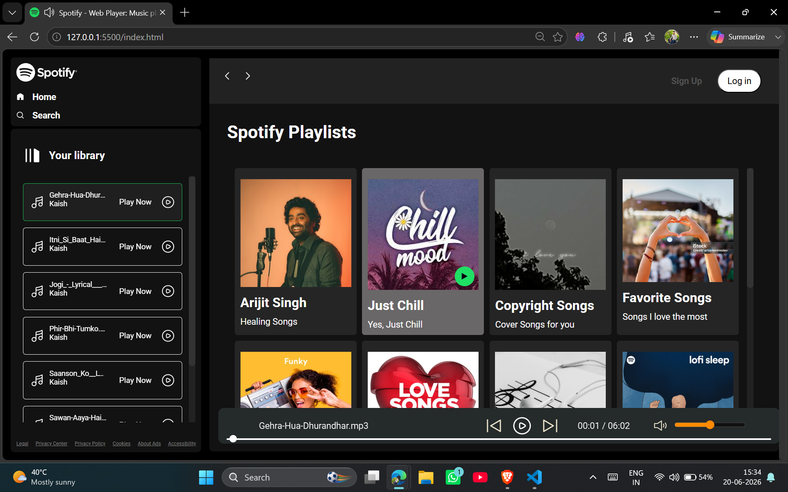
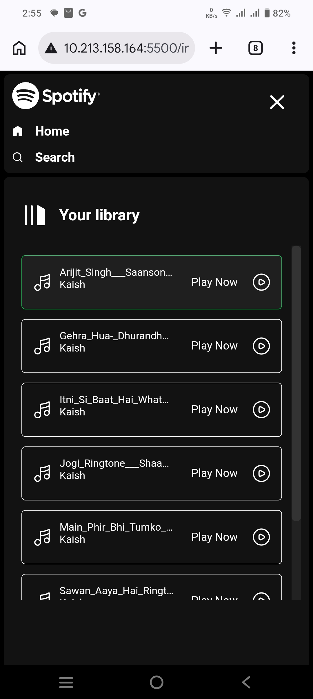
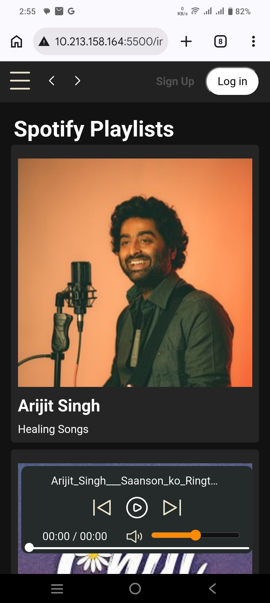

# Spotify Clone 🎵

A responsive Spotify-inspired web music player built using **HTML, CSS, and JavaScript**. This project replicates the core user experience of Spotify, including dynamic playlist loading, music playback controls, album browsing, and a modern responsive interface.

## 🌐 Live Demo

🚀 Experience the Spotify Clone live:

**[View Live Project](https://kaish10-hub.github.io/Spotify-Web-Player/)**

## ✨ Features

* 🎶 Dynamic song loading from local folders
* 📀 Album-based music organization
* ▶️ Play / Pause functionality
* ⏮️ Previous / Next track controls
* 📍 Interactive seek bar for song navigation
* 🔊 Volume control and mute functionality
* 📱 Fully responsive design for desktop, tablet, and mobile devices
* 🎨 Modern Spotify-inspired UI
* 📂 Dynamic playlist generation using JavaScript
* ⚡ Vanilla JavaScript implementation (No frameworks)

## 📸 Project Preview

This Spotify Clone recreates the core music streaming experience with a clean and responsive interface. The application dynamically loads albums and songs, provides playback controls, volume management, and seamless navigation across different playlists. The design is inspired by Spotify's modern UI while being built entirely with vanilla JavaScript, HTML, and CSS.

## Home Screen


## Mobile View
<p align="center">
  
  &nbsp;&nbsp;&nbsp;&nbsp&nbsp;&nbsp;&nbsp;&nbsp;
  
</p>

## 🛠️ Technologies Used

* HTML5
* CSS3
* JavaScript (ES6)
* Fetch API
* DOM Manipulation

## 📂 Project Structure

```bash
Spotify-Web-Player/
│
├── css/
│   ├── style.css
│   └── utility.css
│
├── js/
│   └── script.js
│
├── img/
│
├── songs/
│   ├── album1/
│   ├── album2/
│   └── ...
│
├── index.html
└── README.md
```

## ⚡ Getting Started

1. Clone the repository

```bash
git clone https://github.com/kaish10-hub/Spotify-Web-Player.git
```

2. Navigate to the project folder

```bash
cd Spotify-Web-Player
```

3. Start a local server using VS Code Live Server:
```bash
Right Click → Open with Live Server
```

4. Place your audio files inside the songs directory.

5. Open the application in your browser

## 🎯 Learning Outcomes

This project helped me practice:

* DOM Manipulation
* Event Handling
* Asynchronous JavaScript
* Fetch API
* Responsive Web Design
* Audio API Integration
* Dynamic UI Rendering

## 🔮 Future Improvements

* Search functionality
* Shuffle and Repeat modes
* Playlist creation
* Recently played section
* User authentication and personalized playlists
* Database integration for persistent music libraries
* Music streaming through cloud storage APIs

## 👨‍💻 Author

**Mohd Kaish**

- GitHub: https://github.com/kaish10-hub
- LinkedIn: www.linkedin.com/in/mohd-kaish-b8baa71b3

If you liked this project, feel free to ⭐ the repository.
